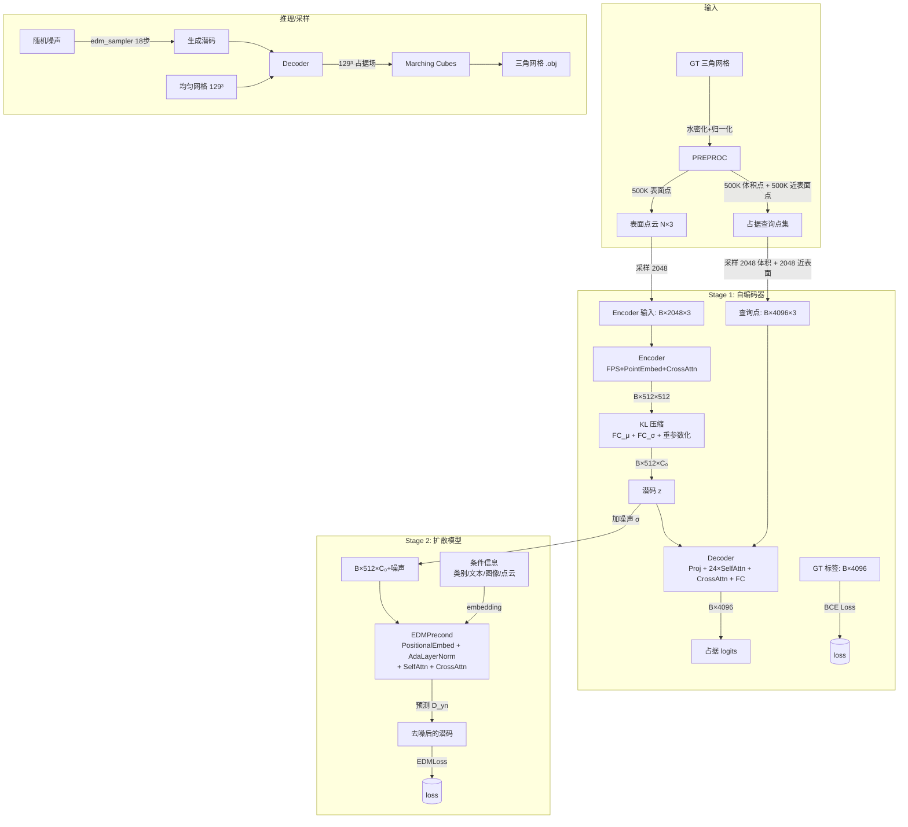

# 3DShape2VecSet 论文深度分析

> **论文**: 3DShape2VecSet: A 3D Shape Representation for Neural Fields and Generative Diffusion Models (SIGGRAPH 2023)  
> **arXiv**: [2301.11445](https://arxiv.org/abs/2301.11445)  
> **代码**: https://1zb.github.io/3DShape2VecSet/

---

## 目录

- [第一部分：论文概述](#第一部分论文概述)
- [第二部分：方法深度拆解（输入输出 + 数据流转 + 设计动机）](#第二部分方法深度拆解输入输出--数据流转--设计动机)

---

## 第一部分：论文概述

### 1. 背景、研究目的和问题

**背景**：
- 扩散模型（Diffusion Models）在 2D 图像生成领域取得了巨大成功（Stable Diffusion, DALL·E, Imagen 等），但在 3D 领域尚未匹配这一成功。
- 3D 数据的表示方式多样：体素（voxels）、点云（point clouds）、网格（meshes）、神经场（neural fields）等。其中神经场具有连续、无限分辨率、可表示任意拓扑的优势。

**核心问题**：
- **如何设计一种 3D 形状表示，使其既适合高保真重建，又适合作为扩散模型的潜空间？**
- 现有表示的三大类都有缺陷：
  - **全局隐向量**（如 OccNet）：简单快速但无法编码细节
  - **规则体素网格**（如 ConvOccNet）：分辨率受限（最大 8³），过大不利于生成模型
  - **不规则网格**（如 3DILG）：潜码附着在 3D 坐标上，表示冗余，生成模型训练困难

**研究目的**：
提出一种新的 3D 形状表示——**潜码向量集（Set of Latents）**，使得：
1. 编码质量高（保真重建细节）
2. 天然适合 Transformer 处理
3. 可作为扩散模型的高质量潜空间

### 2. 新理论/方法/创新点

| 创新 | 描述 |
|------|------|
| **① 潜码集表示** | 形状表示为固定大小的潜码向量集 $\{\mathbf{f}_i\in\mathbb{R}^C\}_{i=1}^M$，**不绑定 3D 坐标**，靠网络自身学习编码空间信息 |
| **② Cross-Attention 编码器** | 用 Cross-Attention 替代 KNN 聚合点云信息，实现从大量输入点云到少量潜码的可学习压缩 |
| **③ 特征空间插值解码** | 解码时用 Cross-Attention 在**特征空间**中插值（而非传统 3D 空间距离插值），公式为：$\mathcal{\hat{F}}(\mathbf{x})=\sum^M_{i=1}\mathbf{v}(\mathbf{f}_i) \cdot \mathrm{softmax}(\mathbf{q}(\mathbf{x})^\intercal\mathbf{k}(\mathbf{f}_i)/\sqrt{d})$ |
| **④ 潜码集扩散框架** | 首次将扩散模型直接应用于**潜码向量集**（而非点云、体素等），支持无条件/类别条件/文本条件/图像条件/点云补全等多种生成任务 |
| **⑤ 点查询编码策略** | 发现用 FPS 下采样点云作为 Cross-Attention 的 Query（而非可学习 Query）效果更好 |

**核心洞见**：径向基函数（RBF）→ 移除显式坐标依赖 → 用 Cross-Attention 实现可学习的"相似度度量" → 得到纯粹的潜码集。

### 3. 研究方法

**两阶段训练策略**：

```
Stage 1: 变分自编码器 (VAE)
  ┌─────────────────────────────────────────────┐
  │  输入: 表面点云 (B×2048×3)                  │
  │  编码器: FPS + PointEmbed + CrossAttn       │
  │  潜码: B×512×C₀ (C₀=8/16/32/64)           │
  │  解码器: 24×SelfAttn + CrossAttn + FC       │
  │  输出: 占据场 logits (B×4096)               │
  │  损失: BCE(占据) + 0.001×KL                  │
  └─────────────────────────────────────────────┘
                          ↓ 冻结编码器
Stage 2: 潜码集扩散模型
  ┌─────────────────────────────────────────────┐
  │  潜码 z ← AE.encode(surface)                │
  │  加噪: z + n, n~N(0, σ²)                    │
  │  去噪网络: LatentArrayTransformer           │
  │   (Transformer + AdaLayerNorm + CrossAttn)  │
  │  损失: EDMLoss (加权MSE)                    │
  │  采样: edm_sampler (18步去噪)               │
  └─────────────────────────────────────────────┘
```

**数据集**：ShapeNet-v2（55 类别），每个形状预处理为水密网格 → 归一化 → 采样 500K 表面点 + 500K 占据查询点

**评估指标**：
- 重建：Chamfer Distance, IoU, F-Score
- 生成：Rendering-FID/KID（Inception 渲染图特征）, FPD/KPD（PointNet++ 点云特征）

**基线方法**：
- 重建对比：OccNet, ConvOccNet, IF-Net, 3DILG
- 生成对比：PVD（点云扩散）, 3DILG（自回归）, NeuralWavelet（小波扩散）, AutoSDF, 3DShapeGen

### 4. 主要发现/结论

1. **重建质量 SOTA**：在 ShapeNet 55 类别上，IoU/F-Score/CD 全面超越 OccNet/ConvOccNet/IF-Net/3DILG，尤其在薄壁结构等难例上优势明显
2. **生成质量 SOTA**：无条件/类别条件生成在 FID/KID/FPD/KPD 上均优于 Grid-8³、3DILG、NeuralWavelet、PVD
3. **点查询 > 可学习查询**：FPS 下采样点作为 CrossAttn Query 优于可学习 Query
4. **KL 压缩高效**：将潜码维度从 C=512 压缩到 C₀=32 几乎不损失重建质量，但大幅降低扩散模型训练难度
5. **M=512 是最优折衷**：更多潜码数提升重建质量但增加计算量
6. **多模态条件可行**：类别嵌入、文本(BERT)、图像(ResNet-18)、部分点云均可作为条件注入扩散模型

### 5. 对该领域的贡献

1. **新表示范式**：提出"潜码集"表示，脱离子 3D 坐标依赖，开辟了神经场表示的新方向
2. **架构创新**：Cross-Attention 编码 + Self-Attention 潜码处理 + Cross-Attention 解码的完整流水线
3. **首个全面的 3D 潜扩散框架**：首次在潜码集上实现扩散模型，并展示 5 种生成应用
4. **新评估指标**：引入 FPD/KPD（基于 PointNet++ 的 3D FID/KID），解决渲染图指标无法直接感知 3D 结构的缺陷
5. **代码开源**：提供完整 PyTorch 实现，促进后续研究

### 6. 存在的局限

| 局限 | 说明 |
|------|------|
| **两阶段训练耗时** | Stage 1 需要 1600 epoch（8×A100），Stage 2 需要 8000 epoch（4×A100），整体训练周期长 |
| **手工设计特征更轻量** | 相比 NeuralWavelet 的小波变换（手工设计），学习到的表示需要更多训练计算 |
| **数据变化需重训练 Stage 1** | 如果形状数据分布变化，AE 需要重新训练，不够灵活 |
| **潜码数 M 受计算限制** | 受 Transformer 复杂度 O(M²) 限制，M=512 难以进一步增大 |
| **无纹理/材质生成** | 当前仅生成占据场/表面几何，不能生成纹理和材质 |
| **stage2 的超参搜索困难** | 扩散模型训练成本高，难以对 stage1 的设计参数做细粒度消融 |

### 7. 一句话核心价值

> **3DShape2VecSet 提出了一种脱离 3D 坐标依赖的潜码向量集表示，通过 Cross-Attention 和 Transformer 架构实现高保真 3D 形状编解码，并首次在该表示上构建扩散模型，实现了多种 3D 内容生成任务。**

---

## 第二部分：方法深度拆解（输入输出 + 数据流转 + 设计动机）

### 总体数据流全景



---

### 模块 1：数据预处理（离线）

**输入**：ShapeNet-v2 原始三角网格  
**输出**：水密网格 + 表面点云 + 占据采样点

| 步骤 | 操作 | 数据维度 | 原因 |
|------|------|---------|------|
| ① 水密化 | 将非水密网格转为水密网格 | 三角网格 → 水密三角网格 | 神经场需要明确的 inside/outside 定义 |
| ② 归一化 | 缩放到 [-1, 1]³ 包围盒 | 顶点坐标归一化 | 统一所有形状的空间范围，便于网络学习 |
| ③ 表面采样 | 从表面均匀采样 500K 点 | 500K × 3 | 为编码器提供足够的表面信息 |
| ④ 占据采样 | 体积内随机 500K 点 + 近表面 500K 点，查询占据值 | 1M × 3 + 1M 标签 | 提供训练神经场的监督信号；近表面密集采样可提升边界精度 |

**为什么做离线预处理？**
- 水密化是 Occupancy Networks 的标配，确保 occupy 标签正确
- 预计算占据值避免训练时实时查询（计算昂贵）
- 近表面密集采样解决 class imbalance（表面附近占据值变化剧烈）

---

### 模块 2：形状编码器（Encoder）

#### 2.1 输入层

| 输入 | 维度 | 来源 |
|------|------|------|
| 表面点云 `pc` | `B × 2048 × 3` | 从水密网格表面 500K 点中均匀采样 2048 个 |
| 占据查询点 `points` | `B × 4096 × 3` | 1024 体积内随机 + 1024 近表面随机（train）；或固定 2048 体积点（val） |
| 占据标签 `labels` | `B × 4096` | 0/1 二值占据标签 |
| 类别 `categories` | `B` | ShapeNet 类别 ID (0-54) |

**为什么输入 2048 个点？**
- 2048 是 PointNet++ 等点云处理的常用规模，足够覆盖表面几何
- 相比原始 500K 点大大降低计算量

#### 2.2 FPS 下采样（Farthest Point Sampling）

```python
# models_ae.py line 244-247
idx = fps(pos, batch, ratio=ratio)  # ratio = M/N = 512/2048 = 0.25
sampled_pc = pos[idx]  # B × 512 × 3
```

| 操作 | 输入维度 | 输出维度 |
|------|---------|---------|
| FPS 下采样 | `B × 2048 × 3` | `B × 512 × 3` |

**为什么做 FPS？**
- 输入点云过大（2048），需要压缩为可管理的潜码数（512）
- FPS 保证采样点均匀覆盖整个表面，避免聚类在密集区域
- 相比随机采样，FPS 能更好地保留薄壁结构等小特征

**后果**：M=512 是计算质量折衷——M 越大重建越好，但 Transformer 的 O(M²) 复杂度限制进一步增大。

#### 2.3 PointEmbed（位置编码）

```python
# models_ae.py line 109-139
# 3D坐标 → 正弦编码 (6×16=96维) → concat 原始坐标 (3维) → MLP → 512维
```

| 操作 | 输入维度 | 输出维度 |
|------|---------|---------|
| 正弦编码 | `B × N × 3` | `B × N × 96` (cos + sin, 每轴16个频率) |
| concat 原始坐标 | — | `B × N × 99` |
| MLP 线性层 | `B × N × 99` | `B × N × 512` |

**为什么用正弦编码？**
- 受 NeRF 启发，高频正弦编码帮助网络学习高频几何细节
- 原始坐标保留（skip connection）保证位置信息不丢失
- 相比 learned embedding，正弦编码更具泛化性

**后果**：编码后的特征同时包含位置信息和频率信息，为后续 Cross-Attention 提供丰富的输入表示。

#### 2.4 Cross-Attention 编码（关键创新）

```python
# models_ae.py line 254-257
cross_attn, cross_ff = self.cross_attend_blocks
x = cross_attn(sampled_pc_embeddings, context=pc_embeddings) + sampled_pc_embeddings
x = cross_ff(x) + x
```

**公式对应**（论文 Eq.6 变体）：
$$\mathrm{Enc}_{\text{points}}(\mathbf{X}) = \mathrm{CrossAttn}(\mathrm{PosEmb}(\mathbf{X}_0), \mathrm{PosEmb}(\mathbf{X}))$$

| 角色 | 来源 | 维度 |
|------|------|------|
| **Q** (Query) | FPS 下采样点的嵌入 | `B × 512 × 512` |
| **K, V** (Key, Value) | 全部 2048 点的嵌入 | `B × 2048 × 512` |
| 输出 | 聚合信息后的潜码 | `B × 512 × 512` |

**为什么用 Cross-Attention 而非 KNN？**
- KNN 根据空间距离**硬选择**邻居，距离度量是固定的（欧氏距离）
- Cross-Attention **学习**相似度度量，QK 点积可以捕捉非局部的语义关系
- 每个潜码可以"关注"到任意位置的输入点，不受距离限制
- 这是与 3DILG（使用 KNN）的核心区别

**后果**：潜码不再与特定 3D 坐标绑定，实现了"纯粹的潜码集表示"。

---

### 模块 3：KL 正则化块（可选）

**输入**：`B × 512 × 512`（编码器输出）  
**输出**：`B × 512 × C₀`（压缩后潜码）+ KL loss

```python
# models_ae.py line 335-375
mean = self.mean_fc(x)      # Linear(512 → C₀)
logvar = self.logvar_fc(x)  # Linear(512 → C₀)
posterior = DiagonalGaussianDistribution(mean, logvar)
z = posterior.sample()      # 重参数化采样
kl = posterior.kl()         # KL散度
```

| 操作 | 输入维度 | 输出维度 |
|------|---------|---------|
| FC_μ | `B × 512 × 512` | `B × 512 × C₀` (C₀=8/16/32/64) |
| FC_σ | `B × 512 × 512` | `B × 512 × C₀` |
| 重参数化 | `B × 512 × C₀` + 噪声 | `B × 512 × C₀` |
| Proj（解码前） | `B × 512 × C₀` | `B × 512 × 512` |

**为什么做 KL 压缩？**
- **降维**：512×512 = 262K 维度 → 512×C₀（C₀=32 时仅 16K），使扩散模型可训练
- **潜空间正则化**：KL 散度迫使潜码分布接近标准正态，这对扩散模型至关重要（扩散假设数据服从高斯分布）
- **结构化**：压缩迫使潜码去除冗余信息，保留最本质的形状特征

**为什么 KL 权重视为 0.001？**
- 太小起不到正则作用，太大损害重建质量
- 实验表明 C₀=32 时重建质量几乎不损失（IoU 从 0.85 降至 0.84）
- 即使 C₀=8 仍能保持合理质量（IoU ~0.82），说明表示高度紧凑

**后果**：
- 良性：扩散模型在低维空间训练，收敛更快、质量更高
- 代价：C₀=64 时扩散模型反而变差（维度诅咒，数据稀疏）

---

### 模块 4：潜码处理网络（Latent Learning / Self-Attention Blocks）

**输入**：`B × 512 × 512`（解码器输入潜码）  
**输出**：`B × 512 × 512`（处理后的潜码）

```python
# models_ae.py line 262-266
for self_attn, self_ff in self.layers:  # 24 layers
    x = self_attn(x) + x    # Self-Attention + residual
    x = self_ff(x) + x      # FeedForward + residual
```

| 操作 | 每层结构 | 信息交互 |
|------|---------|---------|
| LayerNorm → Self-Attention | 8 heads, dim_head=64 | 潜码间全局信息交换 |
| LayerNorm → FeedForward | GEGLU, hidden_dim×4 | 每个潜码内部特征变换 |

**为什么需要 24 层 Self-Attention？**
- 潜码集没有预定义的顺序或空间结构，需要通过 Self-Attention 让潜码间互相"交流"
- 每个潜码初始只"看到"输入点云的一部分（通过 Cross-Attention），需要多次 Self-Attention 融合全局信息
- 类似 Transformer 的深度堆叠，层数越多表达力越强，但计算量线性增长

**为什么用残差连接（+x）？**
- 防止深层网络梯度消失
- 保证初始信息不丢失
- 这是 Transformer 的标准设计

---

### 模块 5：形状解码器（Decoder）

#### 5.1 Cross-Attention 解码（关键创新）

```python
# models_ae.py line 269-276
queries_embeddings = self.point_embed(queries)
latents = self.decoder_cross_attn(queries_embeddings, context=x)
# x 是经过 Self-Attention 处理后的潜码集
```

**公式**（论文 Eq.8）：
$$\mathcal{\hat{F}}(\mathbf{x})=\sum^M_{i=1}\underbrace{\mathbf{v}(\mathbf{f}_i)}_{\text{可学习值}} \cdot \underbrace{\frac{1}{Z}e^{\mathbf{q}(\mathbf{x})^\intercal\mathbf{k}(\mathbf{f}_i)/\sqrt{d}}}_{\text{可学习相似度}}$$

| 角色 | 来源 | 维度 |
|------|------|------|
| **Q** (Query) | 查询点坐标经 PointEmbed | `B × 4096 × 512` |
| **K, V** (Key, Value) | 潜码集（经 Self-Attention） | `B × 512 × 512` |
| 输出 | 每个查询点的插值特征 | `B × 4096 × 512` |

**为什么用 Cross-Attention 替代空间插值？**
- 传统方法（3DILG, ConvOccNet）：根据查询点与锚点的**3D 空间距离**计算插值权重（如高斯核）
  - 空间距离是固定的、手工设计的
  - 需要预定义锚点位置
- 本方法：根据查询点特征与潜码特征的**相似度**计算权重
  - 相似度度量是可学习的（通过 QKV 线性投影）
  - 潜码没有固定位置，完全靠特征匹配
  - 每个潜码可以"关注"任意区域的查询点

**后果**：这是论文最重要的创新。它使潜码集彻底脱离 3D 坐标，让网络自行学习位置信息。

#### 5.2 FC 输出层

```python
# models_ae.py line 227
self.to_outputs = nn.Linear(queries_dim, output_dim)  # Linear(512 → 1)
```

| 操作 | 输入维度 | 输出维度 |
|------|---------|---------|
| FC 层 | `B × 4096 × 512` | `B × 4096 × 1` |

输出 squeeze(-1) 后为 `B × 4096` 的占据 logits，经 sigmoid 后得到占据概率。

---

### 模块 6：训练损失

#### 6.1 Stage 1 损失

```python
# engine_ae.py line 59-66
loss_vol = criterion(outputs[:, :1024], labels[:, :1024])         # 体积点损失
loss_near = criterion(outputs[:, 1024:], labels[:, 1024:])       # 近表面点损失
loss = loss_vol + 0.1 * loss_near + kl_weight * loss_kl
```

| 损失项 | 权重 | 对应查询点 | 原因 |
|--------|------|-----------|------|
| BCE (体积点) | 1.0 | 前 1024 个点（均匀体积采样） | 主体占据预测 |
| BCE (近表面) | 0.1 | 后 1024 个点（近表面密集采样） | 表面细节但权重降低避免主导 |
| KL 散度 | 0.001 | — | 潜空间正则化 |

**为什么近表面损失权重为 0.1？**
- 近表面点数量（1024）与体积点（1024）相同，但近表面区域占据变化剧烈，容易主导训练
- 权重 0.1 平衡了"整体形状准确"和"表面细节精确"两个目标

#### 6.2 Stage 2 损失

```python
# models_class_cond.py line 426-444 (EDMLoss)
sigma = exp(rnd_normal * P_std + P_mean)  # P_mean=-1.2, P_std=1.2
weight = (σ² + 1) / (σ × 1)²              # sigma_data=1
n = randn_like(y) * sigma
D_yn = net(y + n, sigma, labels)
loss = weight * ((D_yn - y)²).mean()
```

**为什么不直接预测噪声 ε（如 DDPM），而是预测去噪后的 D_yn（如 EDM）？**
- EDM 的 preconditioning（c_skip, c_out, c_in, c_noise）让网络始终预测有界值，训练更稳定
- 权重 weight 在不同噪声级别上平衡损失，避免大噪声主导

---

### 模块 7：扩散模型去噪网络（Denoiser）

**输入**：加噪潜码 `B × 512 × C₀` + 噪声级别 σ + 条件  
**输出**：去噪潜码 `B × 512 × C₀`

```python
# models_class_cond.py line 484-510 (EDMPrecond.forward)
# 1. EDM preconditioning: c_skip, c_out, c_in, c_noise
c_skip = σ_data² / (σ² + σ_data²)
c_out = σ × σ_data / sqrt(σ² + σ_data²)
c_in = 1 / sqrt(σ_data² + σ²)
F_x = model(c_in × x, c_noise, cond=cond_emb)
D_x = c_skip × x + c_out × F_x
```

**Transformer 内部结构**：

```
输入: (c_in × x)  B×512×C₀
  ↓ Proj_in: Linear(C₀ → inner_dim)
  ↓ ×12 (or ×24) BasicTransformerBlock:
      ├── AdaLayerNorm + SelfAttn + LayerScale + residual
      ├── AdaLayerNorm + CrossAttn(cond) + LayerScale + residual  ← 条件注入
      └── AdaLayerNorm + FeedForward + LayerScale + residual
  ↓ LayerNorm
  ↓ Proj_out: zero_module(Linear(inner_dim → C₀))
输出: F_x  B×512×C₀
```

**时间步嵌入**：
```
σ → PositionalEmbedding(256) → SiLU(Linear) → SiLU(Linear) → t_emb: 1×1×inner_dim
```
通过 AdaLayerNorm 注入每一层：`x = LayerNorm(x) * (1 + scale) + shift`（scale, shift 来自 t_emb）

**条件注入**：
- 类别条件：`nn.Embedding(55, inner_dim)` → unsqueeze(1) → CrossAttn(context=cond)
- 文本条件：BERT 提取全局特征 → CrossAttn(context=cond)
- 图像条件：ResNet-18 提取特征 → CrossAttn(context=cond)
- 点云条件：AE Encoder 提取潜码集 → CrossAttn(context=cond)

**为什么用 AdaLayerNorm 而非直接加时间步？**
- 扩散模型中噪声级别 σ 需要在每个 token 层面调节特征响应的"增益"
- AdaLayerNorm 通过 scale/shift 调节 LayerNorm 的输出，相当于特征调制
- 相比直接加性注入（Add），这种调制方式更灵活且不改变特征维度

**为什么 CrossAttn 放在 SelfAttn 之后？**
- 先让潜码内部信息交换（SelfAttn），再吸收外部条件（CrossAttn）
- 类似 Stable Diffusion 的 UNet 设计模式

---

### 模块 8：采样推理

#### 8.1 EDM Sampler（18 步去噪）

```
输入: 随机噪声 z_T ~ N(0, σ_max²)  B×512×C₀
  ↓
for t = T → 0 (18 steps):
  1. 可能增加额外噪声 (S_churn)
  2. Euler 步: denoised = net(x_hat, t_hat, cond)
     d_cur = (x_hat - denoised) / t_hat
     x_next = x_hat + (t_next - t_hat) × d_cur
  3. 2阶校正 (Heun): 重新计算 denoised，取平均斜率
  ↓
输出: z_0  B×512×C₀  (生成潜码)
```

**为什么只需 18 步？**
- EDM 使用高级 ODE solver（Heun's 2nd order method）
- 相比 DDPM 的 1000 步，EDM 的噪声调度和 solver 在质量/速度间取得极好平衡

#### 8.2 Marching Cubes 提取网格

```
z_0 → AE.decode(z_0, grid) → 129³ 占据场
  ↓
Marching Cubes (mcubes, threshold=0) → 三角网格
  ↓
trimesh.export → .obj 文件
```

**为什么网格分辨率设 129³？**
- 128³ 内部 + 边界，共计 2,146,689 个查询点
- 128³ 在重建质量和计算量间取得平衡（256³ 需 8 倍计算）
- 足够捕捉薄壁结构细节

---

### 完整数据维度对照表

| 阶段 | 操作 | 输入维度 | 输出维度 | 参数量级 |
|------|------|---------|---------|---------|
| Encoder | 输入取样 | 任意表面点 | B×2048×3 | — |
| Encoder | PointEmbed | B×N×3 | B×N×512 | ~50K |
| Encoder | FPS | B×2048×3 | B×512×3 | — |
| Encoder | CrossAttn(Q:512, KV:2048) | B×512×512 | B×512×512 | ~1M |
| Encoder | CrossAttn FF | B×512×512 | B×512×512 | ~1M |
| KL | FC_μ/σ | B×512×512 | B×512×C₀ | ~260K |
| KL | Proj up | B×512×C₀ | B×512×512 | ~260K |
| Decoder | 24× (SelfAttn+FF) | B×512×512 | B×512×512 | 24×~1M |
| Decoder | CrossAttn(Q:4096, KV:512) | B×4096×512 | B×4096×512 | ~1M |
| Decoder | FC 输出 | B×4096×512 | B×4096×1 | ~512 |
| Diffusion | Transformer ×12 | B×512×C₀ | B×512×C₀ | ~50M |
| Sampling | EDM 18步 | B×512×C₀ | B×512×C₀ | — |
| MC | Marching Cubes | 129³ | 三角网格 | — |

---

### 关键设计决策总结

```mermaid
graph TD
    Q1["问题1: 如何表示3D形状<br/>以便高质量重建+生成?"] --> A1["方案: 潜码集 {f_i∈R^C}^M<br/>不绑定3D坐标"]
    Q1 --> A1_ALT["替代: 体素网格 ConvOccNet<br/>不规则网格 3DILG"]
    
    Q2["问题2: 如何从2048点云<br/>压缩到512潜码?"] --> A2["方案: Cross-Attention<br/>点云→K,V; 下采样点→Q"]
    Q2 --> A2_ALT["替代: KNN聚合(3DILG)<br/>或PointNet++下采样"]
    
    Q3["问题3: 解码时如何根据<br/>查询点插值潜码?"] --> A3["方案: Cross-Attention<br/>查询点→Q, 潜码→K,V"]
    Q3 --> A3_ALT["替代: 空间距离插值<br/>高斯核(KNN)"]
    
    Q4["问题4: 如何让扩散模型<br/>在潜空间工作?"] --> A4["方案: KL压缩+EDM<br/>C=512→C₀=8~64"]
    Q4 --> A4_ALT["替代: 直接在原始维度扩散<br/>(计算不可行)"]
    
    Q5["问题5: 如何注入条件<br/>到去噪网络?"] --> A5["方案: CrossAttn + AdaLayerNorm<br/>类别/文本/图像/点云"]
    
    style A1 fill:#9f9,stroke:#090
    style A2 fill:#9f9,stroke:#090
    style A3 fill:#9f9,stroke:#090
    style A4 fill:#9f9,stroke:#090
    style A5 fill:#9f9,stroke:#090
    style A1_ALT fill:#f99,stroke:#900
    style A2_ALT fill:#f99,stroke:#900
    style A3_ALT fill:#f99,stroke:#900
    style A4_ALT fill:#f99,stroke:#900
```



---

### 为什么这种方法有效？（总结性思考）

1. **Cross-Attention 替代空间操作**：传统方法对"位置"的先验假设（空间距离近=语义相关）不一定正确。Cross-Attention 让网络自行学习"哪些输入点对哪个潜码重要"，这对处理复杂拓扑（如椅子镂空靠背）至关重要。

2. **潜码脱离坐标**：一旦潜码不再绑定 3D 坐标，它们就变成了"纯粹的特征"。可以自由地通过 Self-Attention 交换信息，不受空间距离限制。

3. **两阶段解耦**：Stage 1 专注表示学习，Stage 2 专注分布学习。这种解耦让扩散模型不需要关心"如何表示形状"，只需学习"潜码的分布"。

4. **EDM 框架适配**：EDM 的 preconditioning 和 ODE solver 天然适配潜码集——潜码集是连续值向量，符合 EDM 的连续数据假设。
